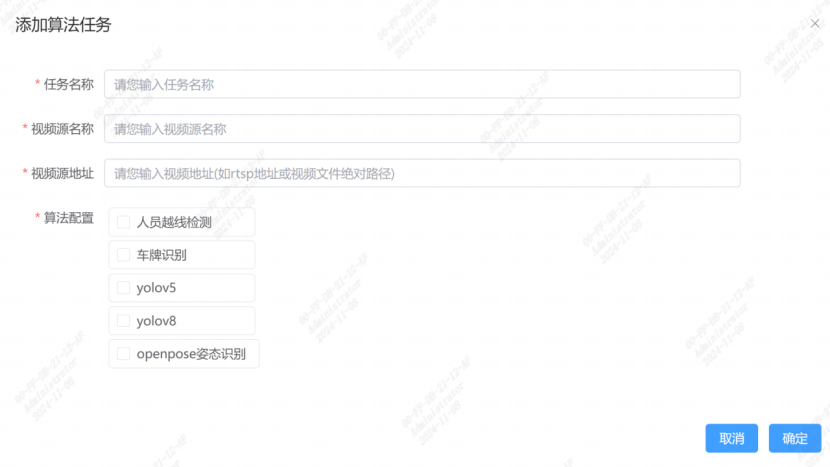

## application-web是基于SOPHON SDK的算法可视化应用平台

- **快速搭建**：前后端一键部署，快速对接sophon-stream算法应用；
- **任务管理**：通过 Web 端轻松管理算法任务等；
- **告警展示**：展示算法告警图片，显示详细信息；

## 启动docker应用包

docker一体化应用包含了application-web、stream-agent、sophon-stream服务，无需配置，直接运行启动。

### 下载和启动容器

``` bash
./docker/scirp.sh BM1688  # BM1684X, BM1684, BM1688 or CV186AH
```

查看容器运行状态

``` bash
docker ps -a
CONTAINER ID        IMAGE                     COMMAND                  CREATED             STATUS              PORTS                            NAMES
16828ceffac6        application-stream-1688   "/bin/bash ./start.sh"   6 minutes ago       Up 6 minutes        22/tcp, 0.0.0.0:8088->8089/tcp   nostalgic_curie
```

### 运行程序

1、浏览器打开页面，这里端口是8088端口  
2、添加任务
可以直接添加RTSP地址，也可以直接使用docker容器内部的视频文件/agent-stream/samples/yolov5/data/videos/test_car_person_1080P.avi，选择算法后直接运行，即可查看检测结果。  
登录用户名和密码均为admin  



## 快速开始

安装包位置：

``` bash
ls back/release/
application-web-linux_arm64.tgz
```

将安装包拷贝到算能SE9设备

``` bash
tar -xzvf application-web.tgz
cd application_web
sudo ./install.sh
```

安装完成后，打开8089端口即可接入页面

对接stream说明  

1. 打开文件：sudo vim /etc/application-web/config/application-web.yaml

``` bash
server:
  port: 8089 #配置服务端口
  password: admin #登录密码
  timeout: 12m
log:
  path: /var/log/application-web #日志保存路径
  level: INFO
db:
  path: /var/lib/application-web/db/application-web.db
  savedays: 15
picture:
  dir: /data/pictures #告警图片保存路径
  maxsize: 1000 #最大容量，单位M
  quality: 90
algorithmhost: 127.0.0.1:8001 #stream的web工作端口
faceAlgohost: 127.0.0.1:19091
uploadhost: 127.0.0.1:8089 # 本机端口
abilities: #stream算法支持能力
  1: "人员越线检测" 
  2: "车牌识别"
```

目前stream支持两种算法，1: "人员越线检测" ；2: "车牌识别"  
如果stream新增支持算法，就在此配置文件新增，如3: "吸烟检测"，重启服务

```bash
sudo systemctl restart application-web
```

## 前端开发

[前端开发环境搭建](./front/README.md)  

#### 前端项目打包

```bash
cd front/
pnpm i
pnpm run build
```

得到dist包

## 后端开发

[后端开发环境搭建](./back/README.md)  

#### 后端项目打包

```bash
cd back/build/
cp -r  ../../front/dist/*  ../dist/
./build_test.sh
```

在release目录得到`application-web-linux_arm64.tgz`包

## tool工具说明

get_frame是基于bmcv获取视频流或视频文件一帧图片工具，供后端代码调用
